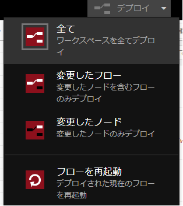
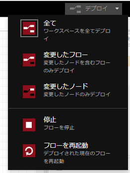
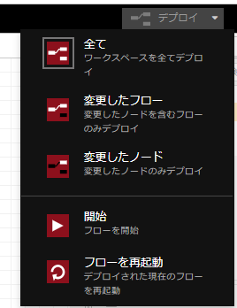
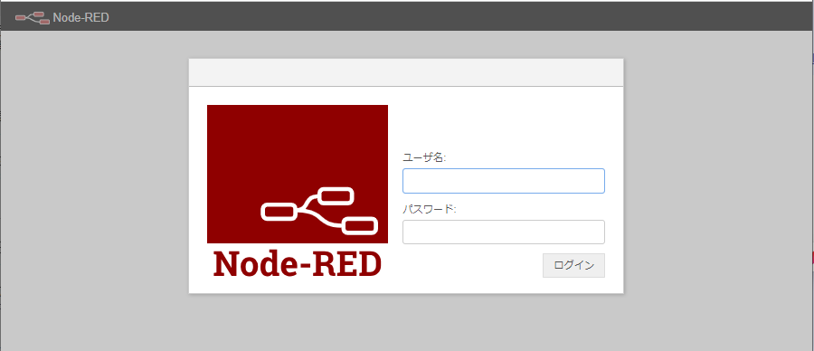
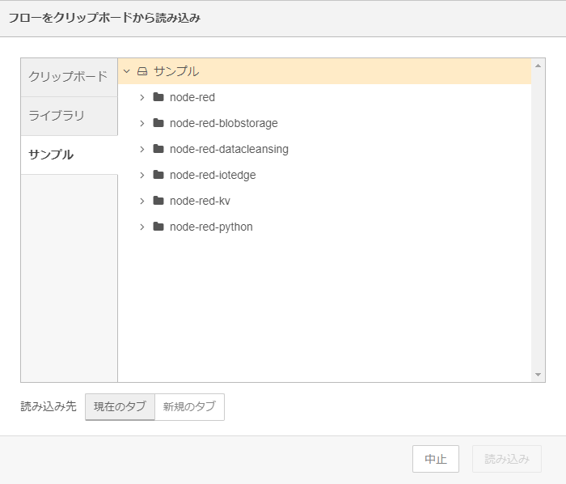

# GAUDINodeRED

## 目次
* [概要](#概要)
* [機能](#機能)
* [Quick Start](#quick-start)
* [ノードモジュール一覧](#ノードモジュール一覧)
* [Pythonパッケージ一覧](#pythonパッケージ一覧)
* [イメージのURL](#イメージのurl)
* [動作保証環境](#動作保証環境)
* [Deployment 設定値](#deployment-設定値)
  * [環境変数](#環境変数)
  * [Desired Properties](#desired-properties)
  * [Create Option](#create-option)
  * [startupOrder](#startuporder)
* [ログ出力内容](#ログ出力内容)
  * [IoTEdgeClient](#iotedgeclient)
  * [Module Input](#module-input)
  * [Module Output](#module-output)
  * [Module Twin](#module-twin)
  * [Module Method](#module-method)
* [受信メッセージ](#受信メッセージ)
* [送信メッセージ](#送信メッセージ)
* [NodeREDにおけるメッセージの扱い](#noderedにおけるメッセージの扱い)
* [Direct Method](#direct-method)
* [NodeREDの機能](#noderedの機能)
  * [フロー停止機能](#フロー停止機能)
  * [ユーザー管理機能](#ユーザー管理機能)
* [LocalACR連携機能](#localacr連携機能)
  * [ユーザー設定保存](#ユーザー設定保存)
  * [ユーザー設定復元](#ユーザー設定復元)
* [ユースケース](#ユースケース)
* [Feedback](#Feedback)
* [LICENSE](#LICENSE)

## 概要
GAUDINodeREDは、カスタムノードを利用可能な Node-RED を展開します。

## 機能
カスタムノードを利用可能な Node-RED を展開する。
> **:exclamation:フローのデプロイについての注意:**
> フローのデプロイを実施する際、必ず<span style="color: red; ">「全て」デプロイ</span>を実施してください。<br>
> 他種別のデプロイ(「更新したフロー」「更新したノード」)は使用しないでください。<br>
> <br>


## Quick Start
1. Personal Access tokenを作成
（参考: [個人用アクセス トークンを管理する](https://docs.github.com/ja/authentication/keeping-your-account-and-data-secure/managing-your-personal-access-tokens)）
 
2. リポジトリをクローン
```
git clone https://github.com/Project-GAUDI/GAUDINodeRED.git
```
 
3. Dockerイメージをビルド
```
docker image build --build-arg GITHUB_TOKEN=<YOUR_Personal_Access_Token> -t <IMAGE_NAME> ./
```
例）
```
docker image build --build-arg GITHUB_TOKEN=<YOUR_Personal_Access_Token> -t ghcr.io/<YOUR_GITHUB_USERNAME>/gaudinodered:<VERSION> ./
```
 
4. Dockerイメージをコンテナレジストリにプッシュ
```
docker push <IMAGE_NAME>
```
例）
```
docker push ghcr.io/<YOUR_GITHUB_USERNAME>/gaudinodered:<VERSION>
```
 
5. Azure IoT edgeで利用

## イメージのURL
準備中

| URL                                                                     | Description          |
| ----------------------------------------------------------------------- | -------------------- |

## ノードモジュール一覧

含まれるノードモジュールは以下の通り。

| ノードモジュール名                | 機能概要                       | バージョン | リンク |
| --------------------------------- | ------------------------------ | ---------- | ------ |
| node-red-blobstorage              | BlogStorage へのアクセス機能   | 6.0.1      | ...    |
| node-red-iotedge                  | iotedge 入出力機能             | 6.0.2      | ...    |
| node-red-kv                       | Keyence レジストリアクセス機能 | 6.0.1      | ...    |
| node-red-python                   | Python コード実行機能          | 6.0.1      | ...    |
| node-red-datacleansing            | データクレンジング機能         | 6.0.3      | ...    |
| node-red-contrib-omron-fins       | オムロンPLCとの通信機能        | 0.5.0      | [node-red-contrib-omron-fins](https://flows.nodered.org/node/node-red-contrib-omron-fins)    |
| node-red-contrib-mcprotocol       | MITSUBISHI PLCとの通信機能     | 1.2.1      | [node-red-contrib-mcprotocol](https://flows.nodered.org/node/node-red-contrib-mcprotocol)    |
| node-red-contrib-python3-function | Python コード実行機能          | 0.0.4      | [node-red-contrib-python3-function](https://flows.nodered.org/node/node-red-contrib-python3-function)    |

※ 以下のノードについては動作保証しない。

  - 上記以外の標準ノード
  - オムロンPLC通信ノード(node-red-contrib-omron-fins)
  - MITSUBISHI PLC通信ノード(node-red-contrib-mcprotocol)
  - Python コード実行機能(node-red-contrib-python3-function)

## Pythonツール一覧

含まれるPythonツールは以下の通り(依存関係パッケージは表記しない)。

| ツール名             | 機能概要                                 | バージョン       |
| -------------------- | ---------------------------------------- | ---------------- |
| python3              | python3本体                              | 3.11.2-1+b1      |
| python-is-python3    | symlinks /usr/bin/python to python3      | 3.11.2-1+deb12u1 |
| python3-pip          | Python package installer                 | 23.0.1+dfsg-1    |

## Pythonパッケージ一覧

含まれるPythonパッケージは以下の通り(依存関係パッケージは表記しない)。

| パッケージ名         | 機能概要                                 | バージョン |
| -------------------- | ---------------------------------------- | ---------- |
| wheel                | パッケージ管理                           | 0.44.0     |
| azure-storage-blob   | Azure blob Storageクライアントライブラリ | 12.15.0    |
| pandas               | データ解析機能提供ライブラリ             | 2.2.2      |

## 動作保証環境

| Module Version | IoTEdge         | edgeAgent       | edgeHub         | amd64 verified on | arm64v8 verified on | arm32v7 verified on |
| -------------- | --------------- | --------------- | --------------- | ----------------- | ------------------- | ------------------- |
| 6.1.6          | 1.5.21          | 1.5.21          | 1.5.21          | ubuntu22.04       | －                  | －                  |

## Deployment 設定値

### 環境変数

#### 環境変数の値

| Key                         | Required | Default       | Recommend | Description |
| ----                        | -------- | ------------- | --------- | ----------- |
| LogLevel                    |          | info          |           | 出力ログレベル。<br>["trace", "debug", "info", "warn", "error"] |
| EnableMetrics               |          | false         |           | メトリクス情報を出力するかのフラグ。<br>trueの場合、フロー実行(メッセージ単位)イベントとメモリ使用情報(15秒おき)が出力される。<br>["true", "false"] |
| EnablePalette               |          | true          |           | パレットマネージャーを表示するかのフラグ。<br>["true", "false"] |
| EnableFlowStop              |          | false         | false     | フローを停止させる機能を有効にするかのフラグ。詳細は[フロー停止機能](#フロー停止機能)参照。<br>["true", "false"]<br><span style="color: red; ">(運用レベルでの利用不可)</span> |
| EnableHttps                 |          | false         |           | https通信を有効にするかのフラグ。<br>有効にした場合、PrivateKeyFilePath・CertificationFilePathの環境変数設定も必要。<br>["true", "false"] |
| PrivateKeyFilePath          | △       |               |           | EnableHttps=trueにした場合、必須。<br>証明書の秘密鍵ファイルのフルパスを指定する。<br>bindフォルダのパスを想定している。 |
| CertificationFilePath       | △       |               |           | EnableHttps=trueにした場合、必須。<br>証明書ファイルのフルパスを指定する。<br>bindフォルダのパスを想定している。 |
| EnableUserLogin             |          | true          |           | ユーザー管理機能を有効にするかのフラグ。<br>詳細は[ユーザー管理機能](#ユーザー管理機能)参照。<br>["true", "false"] |
| AdminPassword               |          | adminP@ssw0rd |           | EnableUserLogin=trueにした場合、有効。<br>Adminユーザーのパスワード<br><span style="color: red; ">(設定推奨)</span> |
| GuestPassword               |          | guestP@ssw0rd |           | EnableUserLogin=trueにした場合、有効。<br>guestユーザーのパスワード |
| EditorRoot                  |          | /             |           | エディターにアクセスするためのURLに付与するパス(※1)。<br>例："/admin"に設定すると、http://[IP]:[HostPort]/admin でエディターにアクセスすることができ、http://[IP]:[HostPort]/ でアクセスできなくなる。     |
| SettingsJSPath              |          |               |           | NodeREDの設定ファイルSettings.jsファイルのパスを指定する。<br>bindフォルダのパスを想定している。<br><span style="color: red; ">この環境変数を使用した場合、この表の前の行までの環境変数設定は全て無効となる。主に開発・検証用の為、本設定を行った際の動作保証はしない。</span> |
| AzureIoTMaxOperationTimeout |          | 3600000       |           | EdgeHubとの接続やメッセージ送受信等の通信において再試行が行われた際のタイムアウト時間。単位はミリ秒。<br>下限は240000で、それ未満の数値を設定した場合は下限値を適用する。<br>数値以外の文字など無効な値を設定した場合は、デフォルト値を適用する。 |
| RetryErrorFilter            |          |               |           | <span style="color: red; ">トラブル回避用のため通常時は利用不可</span><br>EdgeHubとの切断時エラーの種類によって再接続の要否を判定する際に用いられるフィルタが存在する。この環境変数でそのフィルタに対し、エラーを新規追加もしくは判定の変更ができる。<br>現状既知のエラーは全て再接続処理に進むよう設定されている。<br>値は"エラー名=[true もしくは false]"の形で設定する。設定した値以外はデフォルト(再接続処理が行われる)から変更されない。<br>trueに設定した場合は、そのエラーにより切断された時再接続処理に入る。<br>falseに設定した場合は、そのエラーにより切断された時再接続処理が行われない。<br>複数指定したい場合は","で繋ぐ。<br>例："xxxxxError=true,TimeoutError=false"で設定した場合はxxxxErrorがフィルタに追加、TimeoutErrorがfalseに変更され、他のエラーはデフォルトのまま再接続処理される設定となる。 |

※1:URLに利用可能な文字のみ指定可能。それ以外の文字はURLエンコーディングが必要。<br>
&nbsp;&nbsp;参考) [URLエンコード対象の文字について](https://ja.wikipedia.org/wiki/%E3%83%91%E3%83%BC%E3%82%BB%E3%83%B3%E3%83%88%E3%82%A8%E3%83%B3%E3%82%B3%E3%83%BC%E3%83%87%E3%82%A3%E3%83%B3%E3%82%B0)<br>

### Desired Properties

ワークスペースのデプロイ内容による

### Create Option

#### Create Option の値

| JSON Key                               | Type    | Required | Recommend | Description                                 |
| -------------------------------------- | ------- | -------- | --------- | -------------------------------- |
| HostConfig                             | object  | &nbsp;   |           | &nbsp;                                            |
| &nbsp;Binds                           | array   | &nbsp;   |           | Node-RED の設定ファイル格納先をマウントする(※) |
| &nbsp;PortBindings                    | object  | &nbsp;   |           | &nbsp;                                            |
| &nbsp;&nbsp;1880/tcp                  | array   | &nbsp;   |           | &nbsp;                                            |
| &nbsp;&nbsp;&nbsp;HostPort            | string  |&nbsp;    |           | Node-RED エディタへの接続ポート番号の割当   |
| &nbsp;Devices                         | array   | &nbsp;   |           | システムデバイスのバインド設定      |
| &nbsp;&nbsp; {}                       | object  | &nbsp;   |           | &nbsp;      |
| &nbsp;&nbsp;&nbsp;CgroupPermissions | string  | 〇       |           | コンテナグループのパーミッション設定<br>　※"r","w","m" を組み合わせて指定する（例："rw"）<br> ["r": read, "w": write, "m": mknod]     |
| &nbsp;&nbsp;&nbsp;PathInContainer   | string  | 〇       |           | コンテナ上のデバイスパス      |
| &nbsp;&nbsp;&nbsp;PathOnHost        | string  | 〇       |           | ホスト上のデバイスパス      |

※注意事項<br>

- コンテナ内の"/data"ディレクトリをローカルにバインドすることを推奨する。<br>該当のフォルダをバインドしていない場合、コンテナ削除時などにフローや設定などの編集内容が消失してしまう

#### Create Option の記入例

```json
{
  "HostConfig": {
    "Binds": ["/node-red:/data"],
    "PortBindings": {
      "1880/tcp": [
        {
          "HostPort": "1880"
        }
      ]
    }
  }
}
```

### startupOrder

#### startupOrder の値

| JSON Key      | Type    | Required | Default | Recommend | Description |
| ------------- | ------- | -------- | ------- | --------- | ----------- |
| startupOrder  | uint    |          | 4294967295 | 400 | モジュールの起動順序。数字が小さいほど先に起動される。<br>["0"から"4294967295"] |

#### startupOrder の記入例

```json
{
  "startupOrder": 400
}
```

## ログ出力内容

### IoTEdgeClient

| LogLevel | 出力概要 |
| -------- | -------- |
| error    | [クライアント作成/クライアント接続/ツイン取得/タイムアウト設定]失敗<br>クライアント切断<br>クライアントエラー |
| warn     | 無し        |
| info     | クライアント[作成/接続/close]<br>ツイン作成<br>メッセージサイズ上限拡張設定失敗、デフォルト値設定 |
| debug    | タイムアウト値<br>エラーフィルター一覧<br>最大メッセージサイズ     |
| trace    | ツイン内容<br>タイムアウト設定[開始/取得開始]<br>エラーフィルター[設定取得開始/設定]<br> メッセージサイズ上限拡張設定取得開始       |

### Module Input

| LogLevel | 出力概要 |
| -------- | -------- |
| error    | [クライアント取得/受信メッセージ出力]失敗 |
| warn     | 無し        |
| info     | ノード作成<br>メッセージ受信      |
| debug    | 無し    |
| trace    | 受信メッセージ         |

### Module Output

| LogLevel | 出力概要 |
| -------- | -------- |
| error    | [クライアント取得/メッセージ送信]失敗|
| warn     | 無し        |
| info     | ノード作成<br>メッセージ送信      |
| debug    | 無し    |
| trace    | 送信メッセージ        |

### Module Twin

| LogLevel | 出力概要 |
| -------- | -------- |
| error    | モジュールツインエラー<br>クライアント未初期化 |
| warn     | 無し        |
| info     | desiredProperties更新<br>reportedProperties更新      |
| debug    | 無し    |
| trace    | desiredProperties更新内容         |

### Module Method

| LogLevel | 出力概要 |
| -------- | -------- |
| error    | ダイレクトメソッド返信送信失敗 |
| warn     | 無し        |
| info     | ノード作成<br>ダイレクトメソッド呼び出し<br>ダイレクトメソッド返信成功      |
| debug    | 無し     |
| trace    | ダイレクトメソッドリクエスト<br>受信ダイレクトメソッド         |

## 受信メッセージ

- ModuleInputノードを通して他のモジュールからのメッセージ受信を行う
- メッセージのBody, Propertyがmsgオブジェクトに格納される。
- メッセージの内容については[NodeREDにおけるメッセージの扱い](#noderedにおけるメッセージの扱い)を参照
- ModuleInputノードでメッセージ受信時にPropertyとして下記の情報が追加される
  - $.cdidプロパティ(properties配下): 送信元デバイス名
  - $.cmidプロパティ(properties配下): 送信元モジュール名


## 送信メッセージ

- ModuleOutputノードから他のモジュールへのメッセージ送信を行う
- メッセージの内容については[NodeREDにおけるメッセージの扱い](#noderedにおけるメッセージの扱い)を参照
- ModuleOutputノードでメッセージ送信時に下記の操作を行う
  - countメソッド(properties配下): 追加
  - $.cdidプロパティ(properties配下): 削除
  - $.cmidプロパティ(properties配下): 削除


## NodeREDにおけるメッセージの扱い

- NodeRED上ではメッセージはjavascriptベースのmsgオブジェクトで入出力される
- 基本的にはmsg.payloadが主な入出力値の格納先になる
- 他のモジュールからのメッセージ受信はModuleInputノード,<br>モジュールへのメッセージ送信はModuleOutputノードを使用する
  - 送受信時のデータ構成は下記のようになっている

    | JSON Key            | Type   | Description                  |
    | ------------------- | ------ | ---------------------------- |
    | payload             | any    | メッセージの Body 相当       |
    | properties          | object | メッセージの Property 格納先 |
    | &nbsp; propertyList | array  | メッセージの Property 相当   |
    | &nbsp; &nbsp; key   | string | プロパティ名                 |
    | &nbsp; &nbsp; value | string | プロパティの値               |

    ```json
    {
      "payload": {
        "RecordList": [
          {
            "RecordHeader": ["sample.csv"],
            "RecordData": ["A1", "B1", "C1", "D1", "E1"]
          }
        ]
      },
      "properties": {
        "propertyList": [
          { "key": "filename", "value": "sample.csv" },
          { "key": "row_number", "value": "1" },
          { "key": "row_total", "value": "5" },
          { "key": "$.cdid", "value": "topLayerDevice" },
          { "key": "$.cmid", "value": "csvfilereceiver01" }
        ]
      }
    }
    ```


## Direct Method

ModuleMethodノードを起点にダイレクトメソッドを実装する 

## NodeREDの機能

環境変数で有効/無効を設定できる機能について説明する。

### フロー停止機能

環境変数の「EnableFlowStop」をtrueに設定することで有効になる。<br>
有効にした場合、デプロイボタン横の▽から開けるリストに「停止」が含まれるようになる。<br>
一度「停止」を押すと、そのボタンは「開始」に切り替わる。<br>

&nbsp;&nbsp;&nbsp;&nbsp;&nbsp;&nbsp;

フローが停止した状態でも、ノードの編集・デプロイは可能になっている。<br>
また、"/data"フォルダのバインドを行っている場合はコンテナの再起動・削除を行っても停止・開始状態は保持され続ける。

### ユーザー管理機能

環境変数の「EnableUserLogin」をtrueに設定することで有効になる。<br>
有効にした場合、エディタを開く際にログイン操作が必要になる。<br>



<br>本システムでは、以下のユーザが利用可能。

| ユーザ名 |パスワード                                       | 使用不可機能                       |
| ------- | ---------------------------------------------- | --------------------------------- |
| admin   | adminP@ssw0rd or 環境変数「AdminPassword」で設定 | 無し                              |
| guest   | guestP@ssw0rd or 環境変数「GuestPassword」で設定 | デプロイ・設定・パレットマネージャー |

## LocalACR連携機能

LocalACR連携機能により、ユーザー設定(デプロイしたフロー、追加したノード)を保存し、イメージとして復元を可能にする。
本機能の利用には、コンテナ内の/dataフォルダのバインドが必要。

### ユーザー設定保存

実行時のバインドフォルダ配下を、ユーザ設定データとして起動中のNodeREDのコンテナ内に保存する。
本機能は、NodeREDが起動中のデバイス上でLocalACR登録の前処理シェル(※)を介して実行する。
この時、コンテナ内にユーザー設定が保存済み場合は、上書きする。


### ユーザー設定復元
バインドフォルダが空の場合のみ、NodeRED起動時にイメージ内に保存されているユーザー設定データをバインドフォルダにコピーする。
これにより、ユーザ設定が復元された状態のNodeREDが起動する。
バインドフォルダが空でない場合は、復元を行わない。

## ユースケース

基本ノードや各カスタムノードのサンプルフローは、メニューの「読み込み」から挿入することが可能なため、そちらを参照



## Feedback
お気づきの点があれば、ぜひIssueにてお知らせください。

## LICENSE
GAUDINodeRED is licensed under the MIT License, see the [LICENSE](LICENSE) file for details.
